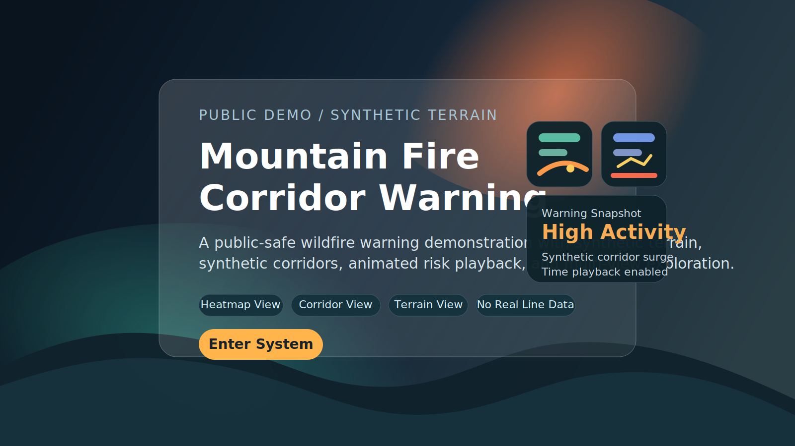

# FireSystem



A visual wildfire warning demo focused on public presentation.
It combines a synthetic mountain landscape, curved warning corridors, animated time playback, and multiple map views in a single lightweight frontend experience.

## Overview

FireSystem is built as a showcase-style warning interface rather than a modeling notebook.
The experience is designed to feel like an operational dashboard: users land on a cover page, enter the system, switch between map views, inspect corridor risk, and follow warning changes through time.

## Highlights

- Clean landing page with direct entry into the warning system
- README cover preview for quick GitHub homepage presentation
- Default heatmap view for a smoother and more natural risk presentation
- Curved corridor rendering with animated glow and width changes
- Multiple visual modes including heatmap, corridor, terrain, and risk grid
- Time slider with automatic playback across the day
- Descriptive warning popups and side-panel summaries
- Fully synthetic content suitable for public sharing

## Preview

The repository homepage now includes a static cover preview so visitors can understand the visual style immediately without opening the local app first.

## Quick Start

Run a local static server from the project folder:

```bash
python -m http.server 8000
```

Then open:

[http://localhost:8000](http://localhost:8000)

You can also double-click `OPEN_DEMO.bat` to start the local server and open the demo automatically.

## How To Use

1. Open the landing page and click `Enter Warning System`.
2. Use the time slider to move through the warning timeline.
3. Keep the default `Heatmap` mode for the main overview.
4. Switch to `Corridor Focus` when you want to inspect warning corridors more directly.
5. Use `Terrain` or `Risk Grid` as supporting views when you need more spatial detail.
6. Click a corridor or a highlighted area to read the warning description in the right panel.

## Interface Guide

- `Heatmap`: best for reading the overall warning field at a glance.
- `Corridor Focus`: emphasizes the curved warning corridors and their intensity.
- `Terrain`: useful for reading mountain structure and landform context.
- `Risk Grid`: useful for precise cell-by-cell inspection.
- `Watch Zones`: optional helper layer for patrol coverage.
- `Hotspot Halo`: optional helper layer for spotlighting active warning areas.

## Project Structure

```text
FireSystem/
  index.html                # Landing page
  system.html               # Main warning system
  app.js                    # Frontend interaction logic
  styles.css                # Visual design and layout
  generate_demo_data.py     # Synthetic dataset generator
  assets/
    readme-cover-preview.svg
  data/
    simulated_risk_map.json
    simulated_risk_map.js
  OPEN_DEMO.bat             # Local one-click launcher on Windows
```

## Notes

This repository is intended for public-facing demonstration and interface presentation.
All map objects, corridors, regions, watch zones, and warning values are synthetic.
